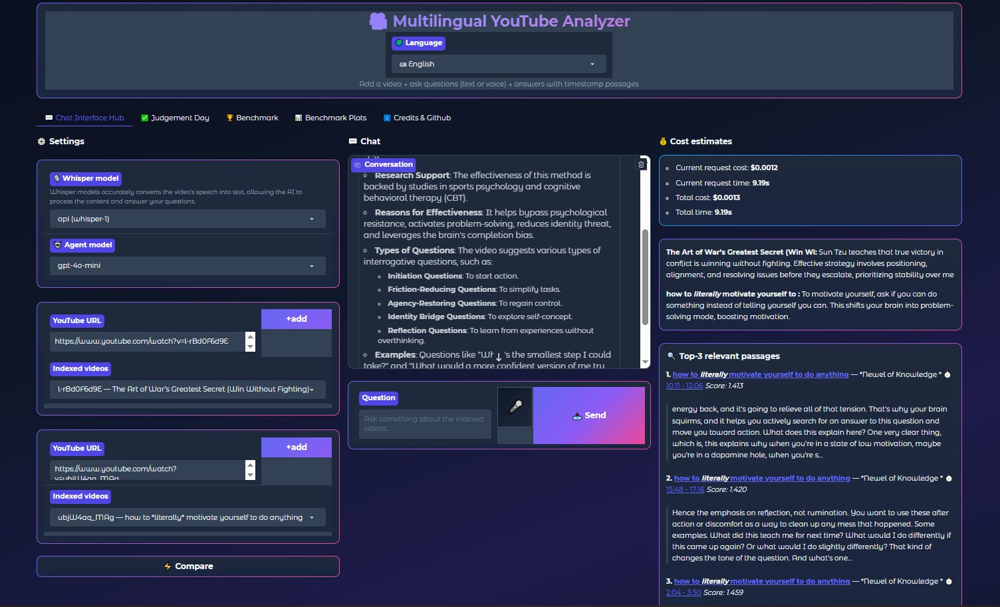
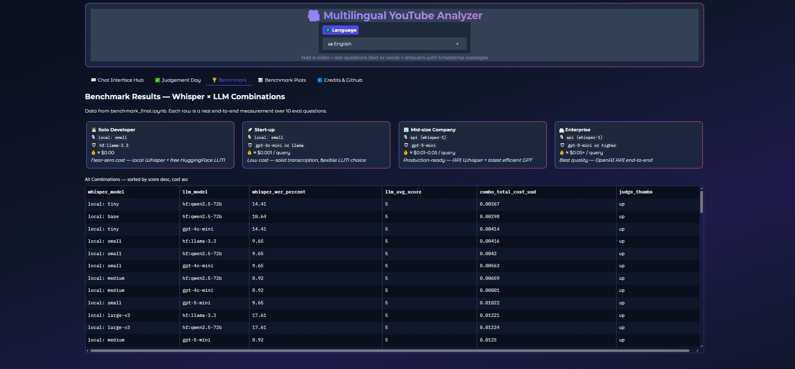
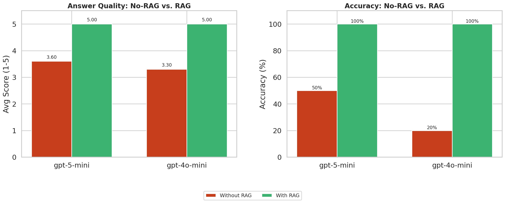

# Multilingual YouTube Analyzer

> **Final Project — Ironhack AI Bootcamp**  
> A production-grade, data-driven Retrieval-Augmented Generation (RAG) system for multilingual question answering over YouTube video content.

[](https://colab.research.google.com/github/DanielHuette/Final-Graduation-Project/blob/main/notebooks/benchmark.ipynb)
[](https://colab.research.google.com/github/DanielHuette/Final-Graduation-Project/blob/main/notebooks/youtube_analyzer.ipynb)


---

## Table of Contents

- [Overview](#overview)
- [System Architecture](#system-architecture)
- [Features](#features)
- [Benchmark-Driven Design](#benchmark-driven-design)
- [Repository Structure](#repository-structure)
- [Getting Started](#getting-started)
- [API Keys](#api-keys)
- [Notebooks](#notebooks)
- [Benchmark Results](#benchmark-results)
- [Screenshots](#screenshots)
- [License](#license)

---

## Overview

The **Multilingual YouTube Analyzer** is a fully data-driven RAG application that enables users to index YouTube videos via audio transcription and interact with the content through a conversational agent. Every architectural decision — Whisper model selection, chunk size, embedding model, and LLM choice — is backed by empirical benchmarks conducted across three videos of varying length (5 min, 17 min, 42 min) and six Whisper model variants.

The system is composed of two Google Colab notebooks:

| Notebook | Purpose |
|----------|---------|
| `benchmark.ipynb` | Seven end-to-end benchmarks measuring transcription quality, retrieval performance, and answer faithfulness |
| `youtube_analyzer.ipynb` | Production RAG application with Gradio UI, LangChain agent, ChromaDB vector store, and LangSmith tracing |

---

## System Architecture

```
YouTube URL
    │
    ▼
yt-dlp (audio download, 64 kbps m4a)
    │
    ▼
Whisper (OpenAI API or local: tiny/base/small/medium/large-v3)
    │  Adaptive chunk size via chunk_recommendations.json
    ▼
tiktoken chunker → ChromaDB (text-embedding-3-small)
    │
    ▼
LangChain ReAct Agent (LangGraph + MemorySaver)
    │  7 tools: search, list, add, metadata, summarize, compare, key moments
    ▼
Gradio UI (10 languages, voice input, timestamp deep-links, cost tracking)
    │
    ▼
LangSmith (EU endpoint — latency & cost tracing)
```

For a detailed technical description of each component see [`docs/ARCHITECTURE.md`](docs/ARCHITECTURE.md).

---

## Features

- 🎙️ **Audio-based ingestion** — yt-dlp downloads audio at 64 kbps; Whisper transcribes with configurable backend
- 🔄 **Switchable Whisper backends** — OpenAI API (`whisper-1`) or open-source (`tiny` / `base` / `small` / `medium` / `large-v3`)
- 🧩 **Adaptive chunking** — chunk size is selected per video duration and Whisper model from empirically derived `chunk_recommendations.json`
- 🛠️ **7 LangChain agent tools** — `search_video_content`, `list_indexed_videos`, `add_new_video`, `get_video_metadata_tool`, `summarize_video`, `compare_videos`, `extract_key_moments`
- 🤖 **Model-agnostic agent** — switchable at runtime: `gpt-4o-mini`, `gpt-5-mini`, `gpt-5`, `gpt-4o`, `hf:llama-3.3`, `hf:qwen2.5-72b`
- 💬 **Conversational memory** — per-session thread memory via LangGraph `MemorySaver`
- 🎤 **Voice input** — microphone recording transcribed via Whisper API
- ⏱️ **Timestamp deep-links** — retrieved passages link directly to the relevant moment on YouTube
- 🌍 **10 UI languages** — English, German, Spanish, French, Turkish, Chinese, Hindi, Italian, Portuguese, Arabic
- 💰 **Live cost tracking** — real-time per-request and session cost estimates
- ✅ **Ground-truth evaluation** — WER (Word Error Rate) comparison between Whisper output and YouTube captions
- ⚖️ **LLM-as-Judge** — faithfulness scoring of agent answers against reference transcripts
- 📊 **LangSmith tracing** — EU endpoint for latency and cost analytics
- 💾 **Persistent storage** — optional Google Drive mounting for ChromaDB persistence

---

## Benchmark-Driven Design

All component choices are grounded in seven systematic benchmarks. See [`docs/TECHNICAL_REPORT.md`](docs/TECHNICAL_REPORT.md) for full methodology and results.

| Benchmark | Variable | Key Finding |
|-----------|----------|-------------|
| B1 — Whisper Model Sizes | 6 models × 3 videos | `whisper-small`: WER 2.40% at $0.00097/run — best cost/quality ratio |
| B2 — Audio Bitrate | 8–128 kbps | 64 kbps = sweet spot; near-identical WER to 128 kbps at half the file size |
| B3 — Embedding Models | 3 models (OpenAI + HuggingFace) | `text-embedding-3-small` matches `large` at a fraction of the cost |
| B4 — LLM Comparison | 5 models, 10 eval questions | `gpt-4o-mini`: score 5.0, latency 1.2 s, $0.00154 — best quality/cost ratio |
| B5 — RAG vs. No-RAG | With/without retrieval | RAG lifts accuracy from 20–70% to ~100% |
| B6 — Chunk-Size Grid | 3 videos × 6 Whisper × N configs | Optimal chunk size scales with video length — no single best config |
| B7 — Full Whisper × LLM Matrix | 6 × 5 = 30 combinations | Data basis for model dropdown and sweet-spot recommendations |

---

## Repository Structure

```
multilingual-youtube-analyzer/
│
├── notebooks/
│   ├── youtube_analyzer.ipynb      # RAG application — run this for the UI
│   └── benchmark.ipynb             # Seven benchmarks — run first (optional)
│
├── benchmark_results/              # Pre-computed benchmark exports
│   ├── prices.json                 # LLM + Whisper pricing data
│   ├── combo_table.csv             # Full Whisper × LLM performance matrix
│   ├── winners.json                # Best combinations per category
│   ├── chunk_recommendations.json  # Optimal chunk configs per video length + Whisper model
│   ├── summary.json                # Key insights from all benchmarks
│   ├── benchmark1_whisper_sizes.csv
│   ├── benchmark2_bitrates.csv
│   ├── benchmark3_embeddings.csv
│   ├── benchmark4_llms.csv
│   ├── benchmark5_rag_vs_norag.csv
│   ├── benchmark6_chunk_grid.csv
│   ├── benchmark7_full_matrix.csv
│   ├── benchmark1.png              # Whisper model comparison plot
│   ├── benchmark2.png              # Bitrate vs. WER plot
│   ├── benchmark4.png              # LLM comparison plots
│   ├── benchmark5.png              # RAG vs. No-RAG plots
│   ├── benchmark6_short_video_heatmap.png
│   ├── benchmark6_medium_video_heatmap.png
│   ├── benchmark6_long_video_heatmap.png
│   ├── benchmark6_short_video_curves.png
│   ├── benchmark6_medium_video_curves.png
│   └── benchmark6_long_video_curves.png
│
├── docs/
│   ├── TECHNICAL_REPORT.md         # Full benchmark methodology and results
│   └── ARCHITECTURE.md             # Detailed system architecture
│
├── .env.example                    # API key template
├── requirements.txt                # All Python dependencies
├── LICENSE                         # All Rights Reserved
└── README.md                       # This file
```

---

## Getting Started

### Prerequisites

- Google account (for Colab)
- OpenAI API key
- HuggingFace token (optional — required for Llama/Qwen models)
- LangSmith API key (optional — for tracing)

### Recommended Execution Order

**Step 1 — (Optional) Run the benchmark notebook**

The benchmark exports are already included in `benchmark_results/`. You only need to run `benchmark.ipynb` if you want to reproduce the results or generate fresh data.

[](https://colab.research.google.com/github/YOUR_GITHUB_USERNAME/YOUR_REPO_NAME/blob/main/notebooks/benchmark.ipynb)

1. Open `notebooks/benchmark.ipynb` in Google Colab
2. Add your API keys to Colab Secrets (see [API Keys](#api-keys))
3. Run all cells top to bottom — estimated runtime: **3–5 hours** on a free T4 GPU
4. Exports are saved to `/content/benchmark_results/`

**Step 2 — Run the YouTube Analyzer**

[](https://colab.research.google.com/github/YOUR_GITHUB_USERNAME/YOUR_REPO_NAME/blob/main/notebooks/youtube_analyzer.ipynb)

1. Open `notebooks/youtube_analyzer.ipynb` in Google Colab
2. Upload the `benchmark_results/` folder to `/content/benchmark_results/` in Colab
3. Add your API keys to Colab Secrets (see [API Keys](#api-keys))
4. Run all cells top to bottom
5. The Gradio UI launches automatically — a public share link (valid 72 h) is printed

---

## API Keys

The notebooks load API keys from three sources in priority order:
1. `.env` file (local development)
2. Environment variables
3. **Colab Secrets** (recommended for Colab — `Tools → Secrets`)

### Required Keys

| Key | Required | Purpose |
|-----|----------|---------|
| `OPENAI_API_KEY` | ✅ Always | Whisper API, GPT models, embeddings |
| `HF_TOKEN` | ⚠️ Optional | HuggingFace Inference API (Llama 3.3, Qwen 2.5) |
| `LANGSMITH_API_KEY` | ⚠️ Optional | LangSmith tracing (EU endpoint) |

Copy `.env.example` to `.env` and fill in your keys for local development:

```bash
cp .env.example .env
# Edit .env with your actual keys — never commit this file
```

---

## Notebooks

### `youtube_analyzer.ipynb`

The main application notebook. Execute cells sequentially:

| Section | Description |
|---------|-------------|
| 1. Installation | Installs all dependencies |
| 2. ffmpeg | Installs ffmpeg for audio processing |
| 3. API Keys | Loads secrets from Colab/env |
| 4. Benchmark Data | Loads pre-computed benchmark exports |
| 5. Audio Download | yt-dlp download pipeline |
| 6. Whisper Transcription | API and local Whisper backends |
| 7. Chunking | tiktoken-based text splitter |
| 8. ChromaDB + Ingestion | Vector store and ingestion pipeline |
| 9. Ground-Truth Evaluation | WER + LLM-as-Judge functions |
| 10. Agent Tools (7) | LangChain tool definitions |
| 11. Agent with Memory | LangGraph ReAct agent factory |
| 12. Smoke Test | Quick pipeline validation |
| 13. LangSmith | Tracing setup |
| 13b. End-to-End Eval | Full agent evaluation loop |
| 14. Gradio Web App | Launch the UI |
| 15. Debug Section | Component-level testing utilities |
| 16. Reset ChromaDB | Wipe vector store |

### `benchmark.ipynb`

Seven benchmarks that produced the configuration data used by the analyzer:

| Section | Description |
|---------|-------------|
| B1 | Whisper model sizes × 3 videos × WER + cost |
| B2 | Audio bitrate sweep (8–128 kbps) |
| B3 | Embedding model comparison (OpenAI + HuggingFace) |
| B4 | LLM comparison — quality, latency, cost |
| B5 | RAG vs. No-RAG faithfulness comparison |
| B6 | Chunk-size grid × 3 videos × 3 Whisper models |
| B7 | Full Whisper × LLM matrix (30 combinations) |
| Export | Writes all results to `benchmark_results/` |

---

## Benchmark Results

Pre-computed results are available in `benchmark_results/`. Place this folder at `/content/benchmark_results/` in Colab before running the analyzer.

### Sweet-Spot Recommendations

| Tier | Whisper | LLM | Est. Cost / Query |
|------|---------|-----|-------------------|
| Solo Developer | `local: small` | `hf:llama-3.3` | ≈ $0.00 |
| Start-up | `local: small` | `gpt-4o-mini` or Llama | ≈ $0.001 |
| Mid-size Company | `api (whisper-1)` | `gpt-5-mini` | ≈ $0.01–0.05 |
| Enterprise | `api (whisper-1)` | `gpt-5-mini` or higher | ≈ $0.05+ |

---

## Screenshots

## Screenshots

### Chat Interface — main application view


The main UI showing a question answered with retrieved passages, 
timestamps, live cost tracking, and top-3 passage ranking.

### Benchmark Results — Sweet-Spot Recommendations


Configuration recommendations for different user profiles 
(Solo Developer, Start-up, Mid-size Company, Enterprise), 
based on systematic Whisper × LLM benchmarking.

### Ground-Truth Evaluation — Judgement Day


Whisper transcript quality (WER) and answer faithfulness (LLM-as-Judge) 
evaluated against official YouTube captions.

### RAG vs. No-RAG Comparison


Empirical demonstration that retrieval-augmented generation 
lifts answer accuracy from 50% (No-RAG) to 100% (With RAG).

### LLM Comparison — Quality, Latency, Cost


Side-by-side comparison of GPT-5, GPT-5-mini, GPT-4o-mini, 
Qwen-2.5-72B, and Llama-3.3 across answer quality, latency, 
and total cost.

---

## License

Copyright © 2025 DanielHuette. All Rights Reserved.

See [`LICENSE`](LICENSE) for full terms.
